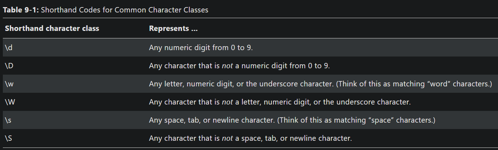

#Long way without regex
```python
def is_phone_number(text):
    if len(text) != 12: #phone numbers have exactly 12 characters
        return False
    for i in range(0, 3): #The first 3 characters must be numbers.
        if not text[i].isdecimal():
            return False
    if text[3] != '-': #The 4th character must be a dash.
        return False
    for i in range (4, 7): #The next 3 characters must be numbers.
        if not text[i].isdecimal():
            return False
    for i in range(8, 12): #The next four characters must be numbers. 
        if not text[i].isdecimal():
            return False
    return True
```

#
```python
block code:
message = 'Call me at 415-555-1011 tomorrow. 415-555-9999 is my office.'
for i in range(len(message)):
    segment = message[i:i+12]
    if is_phone_number(segment):
        print("phone number found:" + segment)
print("Done")
```
```python
#Regex uses
import re
phone_num_pattern_obj = re.compile(r'\d{3}-\d{3}-\d{4}')
match_obj = phone_num_pattern_obj.search("My number is 415-555-4242.")
print(match_obj.group())
```

```python
# | character is called a pipe. It's used as the alternation operator in regex.
# You can use it anywhere you want to match one of multiple expressions.
# ex. r'Cat|Dog' will match either 'Cat' or 'Dog'.

import re
pattern = re.compile(r'Cat(erpillar|astastrophe|ch|egory)')
match = pattern.search("Catch me if you can.")
print(match.group())
print(match.group(1))

#findall() method will return the strings of EVERY match in the searched string. 
#compared to .search() method which will return a match object of the first matched
# text in a searched string.
#Keep in mind: the .findall() method returns a list of strings AS LONG AS THERE ARE NO GROUPS
# IN THE REGULAR EXPRESSION...

import re
pattern = re.compile(r'\d{3}-\d{3}-\d{4}') #This regex has no groups
print(pattern.findall('Cell: 415-555-9999 Work: 212-555-0000'))

#if there are groups in the regex, .findall() will return a list of tuples.
#each tuple represents a single match
#and the tuple has strings for each group in the regex
import re
pattern = re.compile(r'(\d{3})-(\d{3})-(\d{4})') #This regex has groups
print(pattern.findall('Cell: 415-555-9999 Work: 212-555-0000'))

#also, .findall() does not overlap matches...

import re
pattern = re.compile(r'\d{3}')
print(pattern.findall('1234'))
print(pattern.findall('12345'))
print(pattern.findall('123456'))

#QUALIFIER SYNTAX
    #Using Character Classes and Negative Character Classes:
#define a set of characters to match inside square brackets = character class:
# [aeiouAEIOU] will match any vowel, both upper and lower case
# [aeiouAEIOU] = a|e|i|o|u|A|E|I|O|U but easier to type

import re
vowel_pattern = re.compile(r'[aeiouAEIOU]')
vowel_pattern.findall('RoboCop eats BABY FOOD.')
print(vowel_pattern.findall('RoboCop eats BABY FOOD.'))

#Can inclue ranges in classes:
#ex. character class [a-zA-Z0-9] will match all lower/uppercase letters
# and numbers.
# nb. inside square brackets do not nee escape characters like \

#Negative Character class: (will match all characters NOT in the class)
#done by placing a caret ^ just after the class's opening bracket

import re
consonant_pattern = re.compile(r'[^aeiouAEIOU]')
consonant_pattern.findall("RoboCop eats BABY FOOD.")
print(consonant_pattern.findall("RoboCop eats BABY FOOD."))
```

Table 9-1: Shorthand Codes for Common Character Classes
Shorthand character class

| Shorthand | Represents...                                                                            |
|-----|------------------------------------------------------------------------------------------------|
| `\d`|   Any numeric digit from 0 to 9                                                                  |
| `\D`|   Any character that is *not* a numeric digit                                                    |
| `\w`|   Any letter, numeric digit, or the underscore character.<br>(Think of this as matching "word" characters.) |
| `\W`|   Any character that is not a letter, numeric digit, or the underscore character                 |
| `\s`|   Any space, tab, or newline character.<br>(Think of this as matching “space” characters.)       |
| `\S`|   Any character that is not a space, tab, or newline character                                   |
  
  

nb. no shorthand character class that matches only letters, t/f if you want to match only letters try [a-zA-Z] but will only work for roman alphabet letters. 

```python
import re
pattern = re.compile(r'\d+\s\w+')
print(pattern.findall('12 drummers, 11 pipers, 10 lords, 9 ladies, 8 maids, 7 swans, 6 geese, 5 rings, 4 birds, 3 hens, 2 doves, 1 partridge'))
```
### The . character in a regex string matches any character except for a newline.
```python
import re
at_re = re.compile(r'.at')
at_re.findall("The cat in the hat sat on the flat mat.")
print(at_re.findall("The cat in the hat sat on the flat mat."))
```

##Matching an optional pattern:
- ? tags the preceeding qualifier as optional...
```python
import re
pattern = re.compile(r'42!?')
pattern.search('42!')
print(pattern.search('42!'))
```